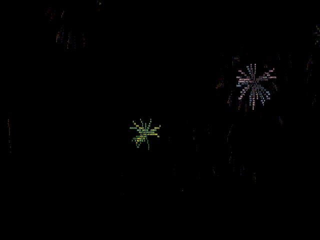

# ASCII-Firework-js / ASCII 烟花 js 

## 简介 / Introduction

- 这是一个可以在web当中放ASCII烟花的项目
- 效果模拟命令行风格并释放字符烟花。

- This is a web-based ASCII fireworks project.
- It simulates a command-line style and displays character-based fireworks animation.

- 配置了wallpaper engine中的配置菜单，上百个可调参数，包括但不局限于：物理参数，频率，颜色预设和自定义
- Configure the configuration menu in Wallpaper Engine, hundreds of adjustable parameters, including but not limited to: physical parameters, frequency, color presets, and customization